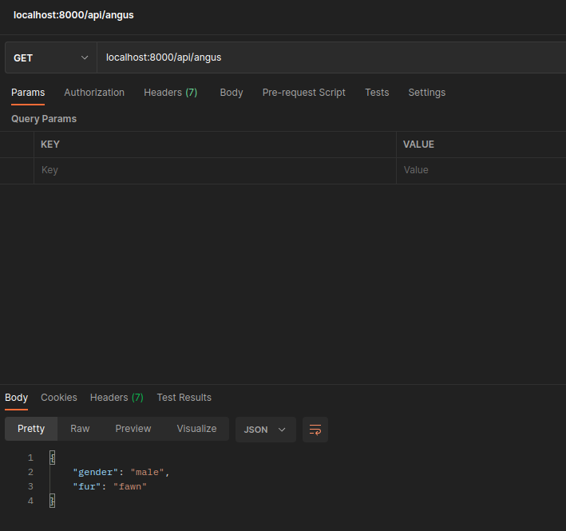

# PugNamesApi

### About PugNamesApi
This fun little api does contain a few names one could use to name a pug dog. As example "Angus".

### How it is done
Tech used: HTML5, JavaScript, Node.js and Express

A little api which will respond with an object upon entering "localhost:8000/api/{Enter Name}, which in this example will just be the colour of the fur, but obviously this can be expanded.

Node.js and its framework Express has been used in development for the variety of modules it offers.

To get started, just open your terminal and enter following commands:

- mkdir pug-names-api
- cd pug-names-api
- npm init
- npm install express

This will allow for Node.js to run on localhost:8000 and Express being installed and implemented into the package.json

### Lessons Learned
The development of this little api to consume has been a good experience on using Node.js and Express to build from scratch.

The steps mentioned in the section to get Node.js and Express running in the project folder are essential. Furthermore it is worth mentioning that a .gitignore should also be created and "node_modules" being mentioned in that file as the modules are quite big and therefore should be avoided to upload to GitHub.